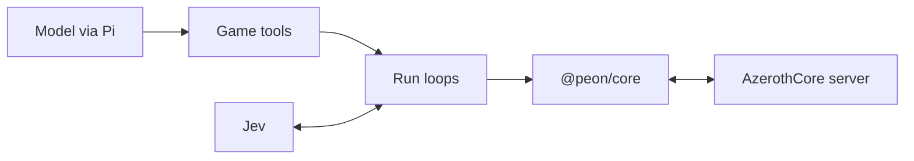

# Peon

Peon is a Pi-based harness that gives an LLM tools to interact with a World of Warcraft 3.3.5a server.

## Run it

### Prerequisites

- An AzerothCore 3.3.5a server. Peon connects to  
  `localhost:3724` by default, or to the `host` and `port` in
  `~/.config/peon/config.toml`.
- The data files of an enUS 3.3.5a (build 12340) client. They supply the
  DBC files for spell and faction names and the navigation mesh for
  walking. The harness plays without the DBC files but shows unknown
  spells and factions as numbers.
- `git` and a C++ toolchain for the navigation library: `bash`, `cmake`,
  `ninja`, `g++` and `nm`.
- For throwaway characters with `soap create`: SOAP enabled on the server,
  the realm service beside it, and a `TCPRESETS` template account. See
  [docs/factory.md](docs/factory.md).
- [mise](https://mise.jdx.dev), which installs Bun and the other tools in
  `mise.toml`.
- A model login for the harness: `/login` inside it (stored in
  `~/.config/peon/auth.json`) or a provider API key such as
  `ANTHROPIC_API_KEY` or `OPENAI_API_KEY`.
- A TypeSafe API key in `TYPESAFE_API_KEY`. Jev needs it for `engage` and
  `pilot`; without it both refuse with `no_combat_helper`, unless
  `PEON_PILOT_CHOOSER=greedy` swaps Jev for code in `pilot`.

### Quick start

1. Clone the repository and install its dependencies and Git hooks:

   ```
   git clone https://github.com/tvararu/peon.git
   cd peon
   mise bundle
   ```

2. Build the patched Namigator library. It is the library only: the
   `MapBuilder` that writes the navigation data comes from Namigator at the
   commit in `vendor/namigator/UPSTREAM`. Build the navigation data from
   your client's `Data` directory, following the command in
   [docs/harness.md](docs/harness.md#dbc-files), and set both
   `navigation_data_dir` and `navigation_library` in
   `~/.config/peon/config.toml`. The supported maps and the DBC table are
   in the same section.

   ```
   mise namigator:build
   ```

   The task prints the library path; set `navigation_library` to it.

3. Write the character you play into `~/.config/peon/config.toml` (mode
   600, since it holds the password):

   ```
   account = "<account>"
   password = "<password>"
   character = "<character>"
   ```

   Or create a throwaway character with SOAP (prerequisites above; the
   JSON profile holds a password, so keep the file private):

   ```
   umask 077
   mise factory soap create eversong10 > "$XDG_RUNTIME_DIR/char.json"
   ```

4. Start the harness from the repository root:

   ```
   export TYPESAFE_API_KEY=<key>
   mise harness
   ```

   With a SOAP profile, pass `--profile "$XDG_RUNTIME_DIR/char.json"`.
5. Type a task, for example `Kill one Springpaw Stalker north of town.`
6. Quit with `/quit`, or Ctrl-D on an empty editor. The harness logs the
   character out first. Delete a throwaway character with
   `mise factory soap delete <ACCOUNT>`.

`mise harness --check` verifies the profile, the lock and the model login
without a game connection: exit 0 with a login, exit 3 without one.

Press F1 to switch to PLAY mode and drive the character yourself with the
keyboard. Esc hands it back to the agent. The keys are in
[docs/harness.md](docs/harness.md#drive-the-character-yourself).

## Architecture



- `@peon/core`: the protocol client. It handles authentication, the world
  session, one code area per group of opcodes, and the stores for game
  state.
- `@peon/harness`: the Pi harness. It holds the game tools, the run loops,
  the Jev combat and pilot loops, navigation, the eval grader and the PLAY
  extension.
- `@peon/devtools`: protocol tables, citation checks, the packet probe and
  the docs lint.
- `@peon/factory`: SOAP accounts and character presets for live testing,
  the Namigator library build, and the dev factory.

## Progress

- **Protocol:** core handles 721 of 933 opcodes. See  
[docs/protocol-coverage.md](docs/protocol-coverage.md), and
`mise protocol:coverage` prints them.
- **Live evals:** 86 scenarios grade a throwaway character against server
truth. See [docs/evals.md](docs/evals.md).
- **Capabilities,** each proven by a scenario in
[docs/capabilities.md](docs/capabilities.md):
  - questing from level 1 to level 5, walking with Namigator navigation,
  Jev-chosen fights and movement, and Jev steering past hostile camps
  without drawing aggro;
  - items, bags, the bank, mail, vendors and trades;
  - talents and glyphs, pets, vehicles, flight paths and zeppelins;
  - raids: convert, subgroups, ready checks and marks.

## Scope

- Only 3.3.5a (build 12340) for now. AzerothCore is the reference server. Peon  
  does not target retail or Classic.
- Headless: no game client is needed to play, only its data files for
  names and navigation.
- Run agents only on servers you run, with characters that are yours.
- Not supported or not proven yet: the auction house has no tool, and no  
  scenario covers inviting players, leaving a group or fighting as a  
  group, ranged hunter combat, sustained levelling across zones or  
  fishing.
- Navigation covers maps 0, 1, 530, 571 and the Deadmines.

## Documentation

- [docs/harness.md](docs/harness.md): the Pi harness, flags and tools.
- [docs/capabilities.md](docs/capabilities.md): what a character can do
  and its limits.
- [docs/evals.md](docs/evals.md): the eval scenarios and how to grade
  them.
- [docs/testing.md](docs/testing.md): unit tests and live test
  characters.
- [docs/protocol.md](docs/protocol.md): protocol references and gotchas.
- [docs/protocol-coverage.md](docs/protocol-coverage.md): the status of
  every opcode.
- [docs/dependencies.md](docs/dependencies.md): the toolchain and why
  each dependency stays.
- [docs/factory.md](docs/factory.md): the dev factory.
- [AGENTS.md](AGENTS.md): the rules for contributors and their agents.

## Other interesting projects

- [Benilla](https://github.com/samwhosung/benilla): a from-scratch 1.12.1
  client in Rust and Bevy.
- [AzerothCore](https://www.azerothcore.org): the 3.3.5a server Peon
  plays on.
- [mod-playerbots](https://github.com/mod-playerbots/mod-playerbots): the
  AzerothCore playerbot module. Peon's protocol citations are checked
  against the playerbots build of AzerothCore.
- [Namigator](https://github.com/namreeb/namigator): pathfinding from the
  game's MPQ files; Peon builds a patched copy.
- [namigator-rs](https://github.com/gtker/namigator-rs): Rust bindings for
  Namigator, an API reference.
- [TypeSafe](https://docs.typesafe.ai): the platform behind Jev.

## License

[GNU AGPL 3.0](LICENSE)
