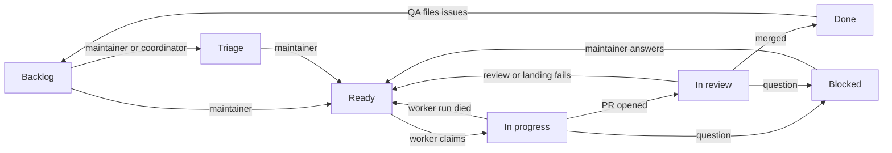

# Dev factory

How the factory works now. History and rationale live in
[plans/2026-09-25-dev-factory-design.md](plans/2026-09-25-dev-factory-design.md).

## Flow

Work state lives in the Status field of the project board
[tvararu/1](https://github.com/users/tvararu/projects/1). Design:
[plans/2026-09-26-project-board-design.md](plans/2026-09-26-project-board-design.md).



Roles are Orca automations running `omp` through `packages/factory/src/omp-factory`,
each in a fresh `auto-*` worktree, from the runner clone
`~/.local/share/peon-factory/runner` (follows `origin/main`; the reaper runs
`bun install --frozen-lockfile --filter @peon/factory` there, because
the factory imports `@peon/core`). Orca's
`agentCmdOverrides.omp` is `~/.local/bin/omp-factory`, a symlink to the
runner's wrapper that `bun packages/factory/src/main.ts setup wrapper --apply`
installs, so the wrapper and its `omp-factory.yml` follow `main`. The wrapper
passes that file as `--config` to factory roles, so they run with omp memory
and autolearn off, and with omp's git integration off: its status line
otherwise runs `gh pr view` on every git change, one to seven GraphQL
points a minute per running agent. Like Orca's own `omp` shell function,
it passes `--extension "$ORCA_OMP_STATUS_EXTENSION"` to every launch when
that file exists, so omp panes report working, idle and done to Orca once
its "Agent status hooks" setting is on. Prompts are in
`packages/factory/src/prompts/`. Every role starts with `bun packages/factory/src/main.ts
precheck <role>` and stops on exit 1.

Orca keeps its own copy of each role's prompt. Every reaper pass, run from
the freshly reset runner clone, edits the prompt of any role automation whose
copy differs from `main` and changes nothing else, so a disabled automation,
the pace schedule and `setupDecision` stay as they are, and a prompt change
is live within one reaper tick of landing. `bun packages/factory/src/main.ts setup
automations --apply` is still how automations are created or their other
fields changed.

`omp-factory` also keeps agents away from the maintainer's character. Every
omp it starts for a factory role, or in any Peon worktree other than the
main checkout (which covers the coordinator's `orca-ide worktree create
--agent omp` launches), gets per-run `XDG_CONFIG_HOME`, `XDG_RUNTIME_DIR`
and `XDG_STATE_HOME`. Config and state live under `factory-xdg/` in the
worktree's git directory (`git rev-parse --absolute-git-dir`), which git
status never shows and worktree removal deletes. The runtime directory is
`$XDG_RUNTIME_DIR/peon-factory-<hash>`, keyed by the first 12 hex
digits of the git directory's SHA-256, because sockets such as
`systemd/private` must fit in 108 bytes and a git directory path grows
with the worktree name. It holds a `.factory-gitdir` link to its git
directory, and each launch deletes the `peon-factory-*` directories
whose git directory is gone. A launch from an already isolated shell
reuses the same directories. Each links every entry of the real directory
except `peon` and the other `peon-factory-*` directories, so `gh`,
git, `mise` and `systemctl --user` find their usual config, state and
sockets, while the harness finds no Peon config and logs in nobody.
The main checkout and other repositories keep the default directories.
Live characters come from `bun packages/factory/src/main.ts soap create
<preset>`; `mise eval run` creates and deletes its own this way. Its
config sets `navigation_library` to the repository's patched build that
`mise namigator:build` installs, and create refuses when that build is
missing; the spell and navigation data paths come from
`~/.config/peon/config.toml`. Create also writes the launcher
`tmp/puppet-<ACCOUNT>`, the soap JSON's `.wrapper`: it exports the
account's own `XDG_*` directories under `tmp/factory-account-<ACCOUNT>/`,
refuses to run when that account's config names another account or
character, prints the character on stderr, and runs the harness's
headless puppet with its arguments (`start --json`, `send -w <name>
<text>`, `read --json`, `nearby --json`, `stop`). Eval graders drive the
second character through it. `soap delete <ACCOUNT>` removes the launcher
and those directories.

`soap create` presets are `fresh`, `eversong10`, `max80`,
`eversong10-warrior`, `eversong10-mage`, `eversong10-hunter` (all Horde,
Eversong), `elwynn1`, `elwynn10` (Alliance, Northshire and Goldshire) and
`ghostlands20`. Each copies a template character from the `TCPRESETS`
account with `pdump copy`; a `PEON_PRESET_<NAME>` key in `soap.env`,
with `-` written as `_`, overrides the template. `pdump copy` can report
success and create nothing, so create confirms the character with `pinfo`
and copies again, up to three attempts, before it fails. Alliance presets
get language 7 (Common) in their config. `soap list` prints the ledger
without passwords; `--with-passwords` prints them.

Graders reach the t1 service (`PEON_T1_SERVICE` in the environment or
`soap.env`, default `http://100.73.138.96:7879`) through
`soap health`, `soap presets`, `soap accounts`, `soap truth <ACCOUNT>`,
`soap setup <ACCOUNT> <endpoint> [json]` and `soap reset <ACCOUNT>`. The
endpoint is one of the service's character endpoints (`position`,
`level`, `money`, `xp`, `hearth`, `rep`, `items/add`, `items/remove`,
`items/clear-bags`, `spells/learn`, `spells/unlearn`, `quest/add`,
`quest/complete`, `quest/remove`, `quest/reward`, `quest/objective`,
`life`, `snapshot`, `restore`) and the JSON object is its body. Each
prints the service's JSON on stdout. A failure prints
`{"ok":false,"reason":...}` with the service's reason code and exits 1.
`soap` refuses any account that is not a factory account before it calls
the service. Setup endpoints refuse an online character
(`character_online`), so stop its puppet or harness first; `truth` saves
an online character before it reads.

## Status

| Status | Moved there by | Meaning |
|---|---|---|
| Backlog | GitHub's auto-add, for every new issue | Filed, not started |
| Triage | the maintainer or the coordinator | Picked to look at now; the factory ignores it like Backlog and never moves a card there, and only the maintainer moves one on to Ready |
| Blocked | any agent, with a comment | Waits on the maintainer; the comment says what the problem is and what to do |
| Ready | the maintainer; agents only when an open factory PR exists; the reaper when the worker run holding the card died | Work on this (rework if a PR is open); oldest first |
| In progress | worker, on claim | A worker owns it |
| In review | worker, on opening the PR | Reviewer, then merger |
| Done | GitHub, on merge or close | Landed or closed |

Moving a card to Ready is the whole release step. No agent moves a card to
Ready unless it already has an open factory PR, no agent @-mentions anyone,
and the Blocked group is the maintainer's inbox. An issue with an open
blocked-by issue stays where it is and is never picked up or landed.

`bun packages/factory/src/main.ts status <issue>` prints a card's Status;
`status <issue> <backlog|triage|blocked|ready|in-progress|in-review|done>` sets it
(adding the issue to the board if missing) and refuses `ready` without an
open `factory/<N>-…` PR.

Comments on the issue are the per-run locks:

- `<!-- factory:claim <run> -->`: a worker's claim. Live for 3 h and only
  if newer than the card's last Status change.
- `<!-- factory:claim <run> <sha> -->`: a reviewer's claim on one head. Live
  for 1 h.
- `<!-- factory:landing <run> -->`: the merger's landing claim. Live for
  1 h; `bun packages/factory/src/main.ts landings` lists the live ones, oldest first,
  and the oldest wins. A reviewer does not pick up a card while it is live.

Two more mark heads for the bounce count:

- `<!-- factory:bounce <sha> -->`: the merger precheck bounced this head.
- `<!-- factory:rebase <sha> -->`: the merger rebased the PR to this head
  and the patch changed, so it needs a fresh review but is not a bounce.

GitHub hides these markers, and a comment that is only a marker renders
as an empty "No description provided." So every factory comment puts
visible text after its marker: the claims and the landing claim one
sentence on the same line saying who is doing what, for example
`<!-- factory:claim <run> --> Factory worker <run> claimed this issue.`
The parsers match only the start of the body, so the text never changes
what a marker means.

## Roles

The worker, reviewer and merger prechecks share one read of the open
issues: the first to run in a 30-second window saves it to `issues.json`
in the factory state directory and the others reuse it, which keeps
every-minute ticks inside GitHub's hourly GraphQL budget. The three
automations start in the same second, so a fetch holds `issues.json.lock`
and the prechecks that find it wait for that fetch instead of running
their own; a lock older than a minute, left by a killed precheck, is
taken over. `landings` and the reaper always read fresh. The read asks
for at most 3 open linked PRs per issue, which is enough while an issue
has one factory PR.

- **Worker.** Takes the oldest Ready card with no live claim, moves it to In
  progress, keeps one workpad comment, proves the change, opens a PR from
  `factory/<N>-<slug>` and moves the card to In review. The proof is
  always `mise ci`; a gameplay change in core or the harness adds one or
  two eval scenarios from the change-area table in
  [evals.md](evals.md), run with `mise eval run <id> --round 0` and
  graded against it, with each scenario's id, verdict, passed and failed
  checks and a short game-log excerpt in `## Proof`. Docs-only and
  factory-only changes prove with `mise ci` only. The worker precheck
  records each pick in `worker-picks.json` in the factory
  state directory and skips, and counts toward the cap, a Ready card it
  picked in the last 3 minutes, so a tick that runs before the previous
  worker has posted its claim does not start the same card. A
  Ready card with an open factory PR is rework. The PR title is the future
  commit subject (Conventional, ≤ 50 chars); the body opens with a why
  paragraph, then `Fixes #N` and `## Proof`. Commits inside the PR don't
  matter. At most 3 attempts per issue, then Blocked (see Attempts).
- **Reviewer.** Takes In review cards whose PR head lacks `factory/review`.
  Runs `mise ci` on the head and posts `factory/ci`, judges the outcome and
  code, and posts `factory/review`. Pass leaves the card In review for the
  merger; fail moves it back to Ready; a product question moves it to
  Blocked. It never runs eval scenarios: it checks that the proof fits the
  change (the right scenario for the area, a verdict that supports the
  claim), and missing or unconvincing proof fails the review.
  If an earlier head passed review and the new head's zero-context patch
  matches it (`same-patch`), the review carries over after CI. Claims are
  per head SHA.
- **Merger.** The precheck first bounces In review cards whose head moved
  after a passing review: it comments "head changed since review" and the
  card stays In review, so the reviewer checks the new head. The third
  moved head since the card's last move to In review moves it to Blocked
  with a comment; once the maintainer moves it back, the count starts
  again, and a head already bounced is never bounced twice. The merger's
  own rebases are not bounces. It then lands one PR at a time: rebase onto
  `main`, `same-patch` against the reviewed head (differs: back to review),
  `mise ci`, push, then `gh pr merge --squash --match-head-commit`. A
  conflict or failing CI sends the card back to Ready with a comment. On
  merge GitHub moves the card to Done.
- **QA.** Runs when `main` moves. Maps new commits to PRs and issues via
  trailers and runs `mise ci`. It then picks up to 3 eval scenarios for the
  files changed since the last QA SHA, with the change-area table, plus 1
  rotating canary: the next id in `mise eval scenario` order, wrapping,
  kept in `~/.local/state/peon-factory/qa-canary`. With no change under
  `packages/core/` or `packages/harness/` it runs the canary only. It runs
  and grades each serially and files one OpenHubris issue with the `qa`
  label per failed check or serious friction, with the scenario, verdict,
  failed check and evidence pasted in; auto-add puts them in Backlog.
  Every agent files as OpenHubris, so the label is what shows that QA
  found an issue. No other role adds, removes or reacts to it.
- **Reaper** (systemd timer, every minute). First syncs the role prompts
  (above), logging a failed edit and carrying on. Then removes finished or
  over-cap `auto-*` worktrees that are clean and pushed or landed, and other
  worktrees that are landed, clean and idle over 12 h. A run is finished
  when Orca marks it `completed` or `failed`, or when it is
  `dispatch_failed` and its terminals and worktree have been quiet for
  2 minutes: Orca's dispatcher gives up on any run still working after
  300 s, and a working omp agent redraws its status line every second.
  A run's unpushed commits on a `factory/<N>-…` branch count as superseded,
  so the run is removed like a landed one and the log says why, when that
  branch's PR is merged or closed, or when the branch on GitHub has an open
  PR and a tip that is not an ancestor of the run's HEAD: a later run or
  the merger rebased and force-pushed it. Commits with no PR, or whose
  branch is missing on GitHub or behind the run's HEAD, are still held.
  Dirty trees are archived to `tmp/worktree-archive-<date>/`. Each hold is
  one draft card in Blocked, `Reaper: <worktree> held (<reason>)`, saying
  what to do; the reaper deletes it once the hold clears.

  A run it removes died if it ended without finishing: Orca marked it
  `failed`, or `dispatch_failed` with its terminals quiet as described
  above, or it is over its cap, but never `completed`. Before removing a
  dead worker run, the reaper looks at every open issue whose latest
  worker claim is that run's. If the card has been In progress since that
  run's claim, it comments which run died, how, and what it left (the
  pushed `factory/<N>-…` branch and the open PR), moves the card back to
  Ready, and then deletes the run's claim comments there, so the next
  worker's race check can't lose to a dead claim. If the card is already
  Ready, it only deletes the claim: that is the retry after a pass that
  moved the card but failed to delete it. Cards in any other Status are
  left alone, as is a card whose latest worker claim belongs to another
  run, and an In progress card moved there after that claim: a new worker
  moves the card before it posts its own claim, and the card is that
  worker's. Orca marks most finished runs `dispatch_failed`, so "died"
  often means "finished"; these checks keep the reaper away from cards a
  run has already handed on. Before removing a dead reviewer run, it
  deletes that run's claim comments, so the head can be reviewed again
  straight away. If a recovery fails, the worktree stays and the next pass
  tries again. A held dead run is recovered only when the reaper removes
  it after the hold clears, so a held worker run's card says what to do if
  the maintainer removes the tree by hand.

## Attempts

A worker run is an attempt only when it opens the first PR or reworks a PR
after a failed review; crash recoveries and merger rebases or CI fixes are
free. `precheck worker` prints a `reason` next to `mode`, from the newest
`factory/review` verdict on the open factory PR's commits, including heads
force-pushed away:

| `reason` | When | Counts |
|---|---|---|
| `fresh` | no open factory PR: the run opens the first one | yes |
| `review` | the newest verdict is a failure on the head | yes |
| `rebase` | the newest verdict passed, so the merger sent the card back: a conflict, failing CI after its rebase, or a head it bounced or rebased | no |
| `recovery` | the newest verdict is a failure on an older head, or there is none: an earlier run died after pushing or before the hand-off | no |

The workpad's `Attempts: k/3` line counts the attempts used, and its
`## Runs` list has one line per worker run with its reason, the PR head it
started from, and its attempt number or "not counted", so the count can be
checked from the issue. A `fresh` run is a `recovery` instead when the list
already has a counted `fresh` run, and a `review` run when it already has a
counted `review` run at the same head: the earlier run died before it
pushed. A run that would be attempt 4 moves the card to Blocked with a
comment saying what keeps failing; `rebase` and `recovery` runs never do.
The maintainer grants another attempt by lowering the `Attempts:` line and
moving the card to Ready.

## Legacy labels

Each reaper run closes any open `Reaper: … held` issue with a comment,
then reconciles every other open issue with the board from its legacy
workflow labels, first match wins: `agent:working` → In progress;
`needs:pm` without `ready` → Blocked; `agent:review`, `agent:reviewing`,
`agent:merging` or `agent:landing` → In review; `agent:rework` or `ready`
→ Ready. An issue with none of these keeps its Status, or goes to Backlog
if it is not on the board. It then removes the legacy labels (these plus
`qa:found` and `p1`, never `qa`) from every issue and deletes them from
the repo. With no legacy labels or held issues left, a run only adds
issues missing from the board to Backlog.

## Landing

`main` is squash-only with linear history. Required statuses: `signoff/ci`
(pre-push hook), `factory/ci`, `factory/review`. Each PR becomes one
commit, authored by OpenHubris:

```
<PR title>

<PR why paragraph, wrapped at 72>

Refs: #<each closed issue>
PR: #<pr>
Co-authored-by: Theodor Vararu <theo@vararu.org>
```

`bun packages/factory/src/main.ts squash-message <pr>` builds it and fails on a bad
title, missing why, or no closed issue. Revert with one `git revert <sha>`.

## Stacked PRs

When an issue needs another open PR's code: the child issue is blocked by
the parent's issue, the child PR's base is the parent's branch, and its body
has `Stacked-on: #<parent PR> <parent tip>`. After the parent lands, GitHub
retargets the child to `main` and the merger runs
`git rebase --onto origin/main <parent tip>`. At most 2-3 deep.

## Pace

`mise factory:pace [pause|default|max]` sets schedules and caps.

| | default | max |
|---|---|---|
| Worker | every 3 min, 3 in flight | every min, 6 |
| Reviewer | every 3 min, 3 in flight | every min, 6 |
| Merger | every 10 min | every min |
| QA | every 30 min | every 15 min |
| Reaper timer | every min | every min |

`pause` disables `work`, `review` and `merge` and leaves `qa` and the
reaper timer running at their current schedules. `default` or `max` ends
a pause: it re-enables the three and sets that level's schedules. While
paused, `mise factory:pace` reports the three as `paused` rather than as
drift, and a manual precheck or `setup automations` uses the `default`
caps and schedules.

`default` and `max` write the reaper timer drop-in
`~/.config/systemd/user/peon-factory-reaper.timer.d/pace.conf`. An
empty `On*Sec=` line in systemd clears every trigger of the timer, so the
drop-in clears both and sets `OnBootSec=` and `OnUnitActiveSec=` to the
reaper interval: without the boot trigger the timer has no next run after
a reboot. It also sets `AccuracySec=1s`: at systemd's default of 1 minute
a 1-minute timer fires every 1 to 2 minutes. Plain `mise factory:pace`
reports the timer as drift when its interval does not match the level,
when its accuracy is not 1 s, when it has no boot trigger, or when it has
no next run and no run in progress.

Run caps: worker 3 h, QA 2 h, reviewer and merger 1 h.
