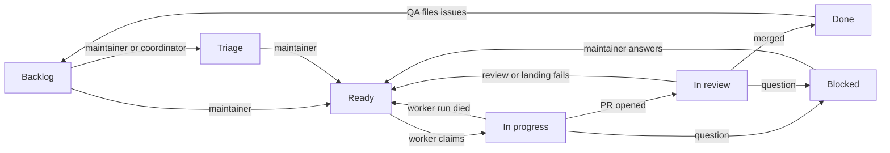

# Dev factory

The factory is one of two ways of working on Peon; the other, paired work
with one interactive agent session, is described in [AGENTS.md](../AGENTS.md).
Design history lives in
[archive/2026-09-25-dev-factory-design.md](archive/2026-09-25-dev-factory-design.md)
and [archive/2026-09-26-project-board-design.md](archive/2026-09-26-project-board-design.md).

## Flow

Work state lives in the Status field of the project board
[tvararu/1](https://github.com/users/tvararu/projects/1).



Roles are Orca automations. Each runs `omp` in a fresh `auto-*` worktree
from the runner clone `~/.local/share/peon-factory/runner`, which follows
`origin/main`. Prompts are in `packages/factory/src/prompts/`. Every role
starts with the runner clone's `main.ts precheck <role>` and stops on
exit 1. The reaper syncs each automation's prompt from `main` every pass;
`mise factory setup automations --apply` creates
automations or changes their other fields.

Orca's `agentCmdOverrides.omp` is `~/.local/bin/omp-factory`, a symlink to
the runner's `packages/factory/src/omp-factory`, installed by
`mise factory setup wrapper --apply`. It passes
`omp-factory.yml` as `--config` to factory roles (memory, autolearn and git
integration off) and passes Orca's status extension when it exists.

`omp-factory` keeps agents away from the maintainer's character: every omp
it starts for a factory role, or in any Peon worktree other than the main
checkout, gets per-run `XDG_CONFIG_HOME`, `XDG_STATE_HOME` and
`XDG_RUNTIME_DIR`. They link every entry of the real directories except
`peon`, so `gh`, git, `mise` and `systemctl --user` work while the harness
finds no Peon config.

## Game accounts

`mise factory soap create <preset>` creates a live
character on a fresh account; `soap delete <ACCOUNT>` removes it, `soap
list` prints the ledger (`--with-passwords` adds passwords). `mise eval
run` creates and deletes its own. Create needs the patched navigation
library from `mise namigator:build`. The account's config connects to the
`host` and `port` in `~/.config/peon/config.toml` (default
`localhost:3724`) and copies its navigation data paths.
Account names hold the creation second and one random byte, so two
creates in the same second can pick the same name; create then retries
with fresh names, up to eight times. The character name maps each hex
digit to a letter, escaping the third letter of a triple as `z`, so
distinct accounts keep distinct characters and names always carry the
creation second.

Presets: `fresh`, `eversong10`, `max80`, `eversong10-warrior`,
`eversong10-mage`, `eversong10-hunter`, `eversong10-priest`, `ghostlands20`
(Horde), `elwynn1`, `elwynn10` (Alliance). Each copies a template character
from the `TCPRESETS` account (read only); a `PEON_PRESET_<NAME>` key in
`soap.env` (`-` as `_`) overrides the template. `eversong1-shaman` is a
created level-1 Orc shaman staged only to the Eversong point, so eval
setup can teach it Reincarnation 20608 and hand it an Ankh 17030. The
created presets `eversong10-shaman`, `eversong10-warlock`,
`eversong10-rogue`, `eversong10-druid` and `eversong55-deathknight` are
built over the protocol instead: `soap create` sends `CMSG_CHAR_CREATE`
without logging in, then stages position, level, money, items and spells
through the realm service.
`soap create ... --trace-create <dir>` also writes every packet of that
create connection, bodies included, to `<dir>/packets.jsonl`.
Only the death knight raises the new account to security 1 inside its own
creation step, and demotes it to 0 with a confirmed `GMLevel: 0` readback
from `account info` before staging; the other created presets never raise privileges. The
`eversong10-fishing` preset copies its template (honoring the same
`soap.env` override) and then stages item 6256 plus one online login that
learns 7733.

`eversong55-deathknight` is selectable, but the realm refuses its create
with `0x33` (`CHAR_CREATE_DISABLED`), so `soap create eversong55-deathknight`
exits non-zero with `Character create: disabled (0x33)`, demotes the
account and deletes it. Observed (trace not committed): a `--trace-create`
`packets.jsonl`
holds the outgoing `CMSG_CHAR_CREATE` (name, race 10, class 6, gender 0) and
the incoming `SMSG_CHAR_CREATE` with body `33`; the same account type, race
and path create a rogue and a warlock live. Source chain (AzerothCore
`Handlers/CharacterHandler.cpp`): `CHAR_CREATE_DISABLED` is sent at lines 286,
329 and 339 (the `CharacterCreating.Disabled*` masks) and at line 436 (the
`CanAccountCreateCharacter` script hook). At security 1 the RBAC role 194
skips the three mask checks, so only line 436 can answer `0x33`. The only
hook in the deployed tree is `mod-individual-progression`
(`IndividualProgressionPlayer.cpp:1326-1360`): it refuses a death knight
while `IndividualProgression.DeathKnightUnlockProgression` (shipped default
13) is non-zero and the account has not rewarded that progression quest;
accounts matching `BotAccountsRegex` or `ExcludedAccountsRegex` pass. The
deployed values of those settings are not observed (the worldserver config is
not readable from the factory host); only the shipped defaults are cited. The
death knight starts at 55 with no level stage if the realm ever accepts it.

Fishing proof (traces not committed): `soap create
eversong10-fishing` gives a pole in the pack and spell 7620. After
`items-move do=equip_to slot=28 to=15` (`CMSG_AUTOEQUIP_ITEM_SLOT`, try1) `soap
truth` shows 6256 in slot 15. The login `SMSG_UPDATE_OBJECT` carries the
skill-356 triple at field offset 681 as `[65892, 4915201, 0]`: skill 356 step
1, value 1, max 75, bonus 0 (the bonus word is outside the update mask, so
zero). One `CMSG_CAST_SPELL` for 7620 at the spawn point (try1) fails with
`SMSG_CAST_FAILED` 0x3c (`SPELL_FAILED_NOT_HERE`, no water in front,
`Spell.cpp:1479`). After `soap gm <ACCOUNT> tele LakeElrendar` the same cast
(try2) gets `SMSG_SPELL_START`, `SMSG_SPELL_GO`, `MSG_CHANNEL_START` (17000 ms)
and a `GAMEOBJECT` create for the "Fishing Bobber" (entry 35591, type 17,
created by the character), destroyed when the channel ends; the bobber
appears. Nothing was caught because the run sends no loot click.

`Tplhunter` carries a level 10 Ravager (entry 17525). Service `reset`
copies a `TCPRESETS` template and so does not know the created presets;
the eval runner never calls it.

Create also writes the launcher `tmp/puppet-<ACCOUNT>` (the soap JSON's
`.wrapper`). It runs the harness's headless puppet as that account, with
its own `XDG_*` directories under `tmp/factory-account-<ACCOUNT>/`:
`start --json`, `send -w <name> <text>`, `read --json`, `nearby --json`,
`stop`. Eval graders drive the second character through it.

Graders reach the realm service, the HTTP helper beside the game server
that reads and sets character state, through `soap health`, `soap
presets`, `soap accounts`, `soap truth <ACCOUNT>`, `soap setup <ACCOUNT>
<endpoint> [json]` and `soap reset <ACCOUNT>`. Endpoints: `position`, `level`,
`money`, `xp`, `hearth`, `rep`, `items/add`, `items/remove`,
`items/clear-bags`, `spells/learn`, `spells/unlearn`, `quest/add`,
`quest/complete`, `quest/remove`, `quest/reward`, `quest/objective`,
`life`, `snapshot`, `restore`. Output is the service's JSON; a failure
prints `{"ok":false,"reason":...}` and exits 1. Only factory accounts are
accepted, and setup refuses an online character, so stop its puppet
first. The service URL is `PEON_REALM_SERVICE`, from the environment or
`soap.env`; it has no default, and these commands fail naming it when it
is unset.

`soap gm <ACCOUNT> <verb> [args...]` stages state for a worker's live
proof with a console command over SOAP. It fills in the character name
itself and runs only on factory accounts whose ledger entry was created
from the current worktree; every command is appended to
`~/.local/state/peon-factory/gm.log`. It prints `{account, verb, command,
ok, text}` and exits 1 when the server refuses. Never use it inside an
eval; eval staging stays with `soap setup`.

| Verb | Console command |
|---|---|
| `level <1-80>` | `character level <C> <n>` |
| `tele <name>` | `tele name <C> <name>` |
| `learn <spell>`, `unlearn <spell>` | `player learn\|unlearn <C> <spell>` (online only) |
| `items <id>:<n>...` | `send items <C> "Peon" "staging" <id>:<n>...` (up to 12 pairs) |
| `money <copper>` | `send money <C> "Peon" "staging" <copper>` |
| `mail <subject>` | `send mail <C> "<subject>" "staging"` |
| `quest <add\|complete\|reward\|remove> <id>` | `quest <op> <id> <C>` |
| `revive`, `kick`, `combatstop`, `reset-talents` | `revive <C>`, `kick <C>`, `combatstop <C>`, `reset talents <C>` |
| `achievement <id>` | `achievement add <id> <C>` |
| `guild-create <name>` | `guild create <C> "<name>"` (online only) |
| `guild-invite <ACCOUNT2> <name>` | `guild invite <C2> "<name>"` |
| `arena-create <2\|3\|5> <name>` | `arena create <C> "<name>" <type>` (online only) |
| `reset-achievements` | `reset achievements <C>` |
| `deserter-bg <n><s\|m\|h>` (at most 1h) | `deserter bg add <C> <duration>` |
| `rename\|customize\|changefaction\|changerace <name>` | `character rename\|customize\|changefaction\|changerace <name>` on a second character of the account |
| `guild-delete <name>` | `guild delete "<name>"` |
| `arena-disband <teamId>` | `arena disband <teamId>` after `arena info` shows a `Fac` team that `<C>` captains |
| `read <kind>` | `group list`, `mail list`, `pet list`, `character titles`, `character reputation` or `pinfo` on `<C>` |
| `read characters`, `read bf-queue` | `lookup player account <ACCOUNT>`, `bf queue 1` (Wintergrasp) |
| `read guild <name>`, `read arena <teamId>`, `read arena-lookup <name>` | `guild info "<name>"`, `arena info <teamId>`, `arena lookup <name>` |

Numbers are positive integers, subjects and names match
`^[A-Za-z0-9 ]{1,24}$`, guild names and new arena team names start with
`Fac`, and a tele name is one token. The four character-screen verbs first
run `lookup player account` and refuse a name that is not on the account
or is the ledger's own character; the flag applies at that character's
next login. Only the `read` verbs read state. Console commands cannot
choose talents, set reputation or fly speed, grant taxi nodes, or kill a
character: those commands are `Console::No`.

## Status

| Status | Moved there by | Meaning |
|---|---|---|
| Backlog | GitHub's auto-add, for every new issue | Filed, not started |
| Triage | the maintainer or the coordinator | Picked to look at; the factory ignores it, and only the maintainer moves it to Ready |
| Blocked | any agent, with a comment | Waits on the maintainer; the comment says what to do |
| Ready | the maintainer; agents only when an open factory PR exists; the reaper when the worker run died | Work on this (rework if a PR is open); oldest first |
| In progress | worker, on claim | A worker owns it |
| In review | worker, on opening the PR | Reviewer, then merger |
| Done | GitHub, on merge or close | Landed or closed |

Moving a card to Ready is the release step. No agent @-mentions anyone;
Blocked is the maintainer's inbox. An issue with an open blocked-by issue
is never picked up or landed.

`mise factory status <issue> [<status>]` prints or sets
a card's Status (`backlog`, `triage`, `blocked`, `ready`, `in-progress`,
`in-review`, `done`) and refuses `ready` without an open `factory/<N>-…` PR.

Issue comments are the per-run locks; each has one visible sentence after
the marker:

- `<!-- factory:claim <run> -->`: a worker's claim; live for 3 h and only
  if newer than the card's last Status change.
- `<!-- factory:claim <run> <sha> -->`: a reviewer's claim on one head;
  live for 1 h.
- `<!-- factory:landing <run> -->`: the merger's landing claim; live for
  1 h, oldest wins (`mise factory landings`).
- `<!-- factory:bounce <sha> -->`: the merger bounced this head.
- `<!-- factory:rebase <sha> -->`: the merger rebased to this head and the
  patch changed; needs a fresh review, not a bounce.

## Roles

- **Worker.** Takes the oldest Ready card with no live claim, moves it to
  In progress, keeps one workpad comment, opens a PR from
  `factory/<N>-<slug>` and moves the card to In review. Proof is `mise ci`;
  a gameplay change in core or the harness adds one or two eval scenarios
  from the change-area table in [evals.md](evals.md) (`mise eval run <id>
  --round 0`), with id, verdict, checks and a log excerpt in `## Proof`.
  The PR title is the future commit subject (Conventional, ≤ 50 chars); the
  body is a why paragraph, `Fixes #N` and `## Proof`. A Ready card with an
  open factory PR is rework.
- **Reviewer.** Takes In review cards whose head lacks `factory/review`,
  runs `mise ci` and posts `factory/ci`, then judges code and proof and
  posts `factory/review`. Pass leaves the card for the merger, fail moves
  it to Ready, a product question to Blocked. It never runs evals; missing
  or unconvincing proof fails. A head whose zero-context patch matches an
  earlier passing head (`same-patch`) keeps that review after CI.
- **Merger.** Bounces In review cards whose head moved after a passing
  review ("head changed since review"; the reviewer checks the new head).
  The third bounce since the card entered In review moves it to Blocked;
  a head is never bounced twice and the merger's own rebases do not count.
  Then it lands one PR at a time: rebase onto `main`, `same-patch` against
  the reviewed head (differs: back to review), `mise ci`, push,
  `gh pr merge --squash --match-head-commit`. A conflict or failing CI
  sends the card to Ready with a comment.
- **QA.** Runs when `main` moves. Maps new commits to PRs and issues, runs
  `mise ci`, then up to 3 eval scenarios for the changed files plus one
  rotating canary (only the canary when nothing under `packages/core/` or
  `packages/harness/` changed). Files one issue with the `qa` label per
  failed check or serious friction; auto-add puts it in Backlog.
- **Reaper** (systemd timer). Syncs role prompts, then removes finished or
  over-cap `auto-*` worktrees that are clean and pushed or landed, and
  other worktrees that are landed, clean and idle over 12 h. Unpushed
  commits on a `factory/<N>-…` branch whose PR closed, or whose remote tip
  moved on, count as superseded. Dirty trees are archived to
  `tmp/worktree-archive-<date>/`. Each held worktree gets one draft card in
  Blocked, `Reaper: <worktree> held (<reason>)`, deleted once the hold
  clears. When a worker run died while its card is still In progress
  under its claim, the reaper comments what it left, moves the card to
  Ready and deletes the claim; for a dead reviewer run it deletes the
  claim so the head can be reviewed again. It also migrates issues still
  carrying the old workflow labels (`agent:*`, `needs:pm`) to board
  Statuses and deletes those labels.

## Attempts

A worker run is an attempt only when it opens the first PR or reworks after
a failed review. `precheck worker` prints a `reason`:

| `reason` | When | Counts |
|---|---|---|
| `fresh` | no open factory PR: the run opens the first one | yes |
| `review` | the newest verdict is a failure on the head | yes |
| `rebase` | the newest verdict passed, so the merger sent the card back | no |
| `recovery` | the newest failure is on an older head, or there is none: an earlier run died | no |

The workpad's `Attempts: k/3` line counts attempts; its `## Runs` list has
one line per run. A run that would be attempt 4 moves the card to Blocked
with a comment. The maintainer grants another attempt by lowering the
`Attempts:` line and moving the card to Ready.

## Landing

`main` is squash-only with linear history. Required statuses: `signoff/ci`
(pre-push hook), `factory/ci`, `factory/review`. Each PR becomes one
commit, authored by OpenHubris:

```
<PR title>

<PR why paragraph, wrapped at 72>

Refs: #<each closed issue>
PR: #<pr>
Co-authored-by: Theodor Vararu <theo@vararu.org>
```

`mise factory squash-message <pr>` builds it and fails
on a bad title, missing why, or no closed issue. Revert with one
`git revert <sha>`.

## Stacked PRs

When an issue needs another open PR's code: the child issue is blocked by
the parent's issue, the child PR's base is the parent's branch, and its body
has `Stacked-on: #<parent PR> <parent tip>`. After the parent lands, GitHub
retargets the child to `main` and the merger runs
`git rebase --onto origin/main <parent tip>`. At most 2-3 deep.

## Pace

`mise factory pace [pause|default|max]` sets schedules and caps; with no
argument it shows them and reports drift.

| | default | max |
|---|---|---|
| Worker | every 3 min, 3 in flight | every min, 6 |
| Reviewer | every 3 min, 3 in flight | every min, 6 |
| Merger | every 10 min | every min |
| QA | every 30 min | every 15 min |
| Reaper timer | every min | every min |

`pause` disables `work`, `review` and `merge` and leaves `qa` and the
reaper running; `default` or `max` ends a pause. Both write the reaper
timer drop-in `~/.config/systemd/user/peon-factory-reaper.timer.d/pace.conf`.

Run caps: worker 3 h, QA 2 h, reviewer and merger 1 h.
